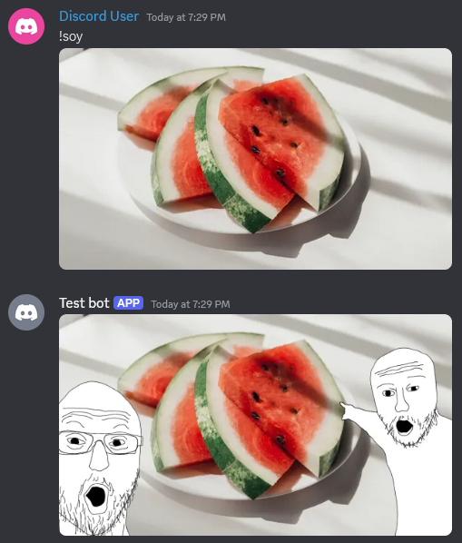

# the-bot-v6

A general all-purpose discord bot, made for fun. Currently, it is being ported from another private bot project (also written by me) and made public. Most features from that bot can be safely made public here. There is no live demo for now, but the code can be downloaded and ran.


## Features

Most of the features come from a private bot (also written by me), but I refactor as I include more features. 

### Feature highlights

Soy command



Calculate command


Translate command


Help command


### Feature checklist:
- [x] Some fun and randomizer commands
- [x] Automatic status updating
- [x] Calculate command
- [x] Autogenerated help command - displays the available commands and explains them in more detail
- [x] Translation command - translates a message
- [x] Daily pope message each day at 21:37 
- [x] Daily prophecies, random time intervals
- [x] A feature allowing admins to toggle channels for prophecies and pope messages
- [x] Soy image editing command
- [x] Random color palette generation
- [ ] More info commands, for example info about the bot, info about the server, etc.
- [ ] Ytdl command

### Future features:
- Automod
- Warnings system


## Installation

You will need:
- Rust
- Some PostgreSQL database (e.g., Supabase)
- A Discord account

Installation steps:
1. Clone the repository
2. Create a discord bot [here](https://discord.com/developers/applications)
    - Go to the `Bot` section and click "Reset TOKEN", copy the TOKEN and keep it for later
    - On the same `Bot` section, scroll down until you see `Privileged Gateway Intents` and make sure all 3 are turned on
    - Go to the `OAuth2` section, scroll down and check the `bot` and `application.commands` boxes.
    - On the same `OAuth2` section, scroll down and check the `Administrator` box (not a requirement but that's the easiest way if you've never created a discord bot before)
    - Copy the `Generated URL`, paste it in the url bar of your web browser
    - Pick one of the servers and the bot should join it (if no discord servers are available, create one)
3. Create a postgres database (can be local, can be [supabase](https://supabase.com/), anything with a connection string works)
4. In the repository's root level, add a `Secrets.toml` file and copy-paste this into it:
```sh
DISCORD_TOKEN = "your discord bot TOKEN"
DATABASE_URL = "your postgres connection string"
TRANSLATION_KEY = "oops I forgot there's also a translation key, the translation feature isn't that impressive anyway, leave this as is"
```
5. Install `shuttle` with `cargo install cargo-shuttle`
6. Install `sqlx-cli` with `cargo install sqlx-cli`
7. Run the migrations with `sqlx migrate run`
6. Run the bot with `cargo shuttle run`

### Remarks: 
If you really want to try out the translation command, grab an api key from [here](https://rapidapi.com/translated/api/mymemory-translation-memory) and paste it in the `Secrets.toml` file.

It may take some time for slash commands to register, so don't worry if you don't see them immediately. You can always activate commands by typing `!command_name`.

Shuttle is not needed for bot development. For pure bot development only the `serenity` and `poise` crates are needed. However, shuttle makes deployment way easier, besides that all it takes to migrate a serenity+poise bot to shuttle is a few lines of code changed in `main.rs`. Find out more about shuttle [here](https://www.shuttle.rs/).


## Contributing

Contributions are welcome! If you have suggestions for improvements or new features, feel free to open an issue or submit a pull request.


